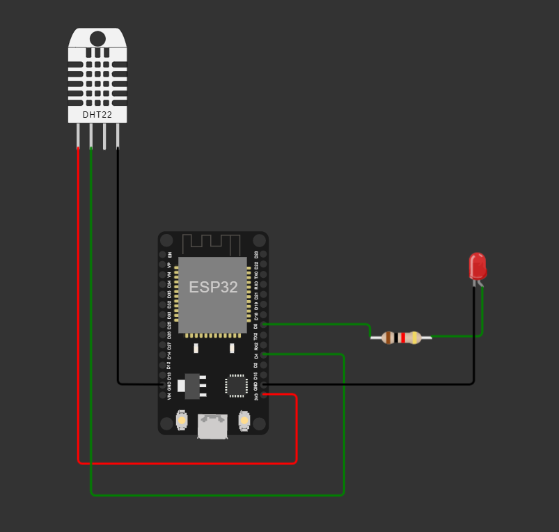

# ESP32 Arduino IDE code

in order to test the code wokwi can help

```
https://wokwi.com/projects/329499808265929300
```
# **the needed libraries**
Libraries needed :
- DHT sensor library for ESPX.
- pubsubClient
- WiFi

# **the material needed**



**in the unlikely event the site doesn't work here's the code**
```
// heck source code by M3ofer
#include <WiFi.h>
#include "PubSubClient.h"
#include "DHTesp.h"


const char* ssid = "Wokwi-GUEST";
const char* password = "";
const int DHT_PIN = 4;

const char* mqttServer = "test.mosquitto.org";
int port = 1883;

String stMac;
char mac[50];
char clientId[50];
WiFiClient espClient;
PubSubClient client(espClient);
DHTesp dhtSensor;
const int ledPin = 5;

void setup() {
  Serial.begin(115200);
  randomSeed(analogRead(0));

  delay(10);
  Serial.println();
  Serial.print("Connecting to ");
  Serial.println(ssid);

  wifiConnect();
  
  Serial.println("");
  Serial.println("WiFi connected");
  Serial.print("MAC address: ");
  Serial.println(WiFi.macAddress());
  client.setServer(mqttServer, port);
  client.setCallback(callback);
  pinMode(ledPin, OUTPUT);
  //showing temperature
  dhtSensor.setup(DHT_PIN, DHTesp::DHT22);
  TempAndHumidity  data = dhtSensor.getTempAndHumidity();
  Serial.println("Temperature : " + String(data.temperature, 2));

}

void wifiConnect() {
  WiFi.mode(WIFI_STA);
  WiFi.begin(ssid, password);
  while (WiFi.status() != WL_CONNECTED) {
    delay(500);
    Serial.print(".");
  }
}

void mqttReconnect() {
  while (!client.connected()) {
    Serial.println("Attempting MQTT connection...");
    //long r = random(1000);
    sprintf(clientId, "client-esp32");
    if (client.connect(clientId)) {
      Serial.print(clientId);
      Serial.println(" connected");
      client.subscribe("/swa/led");
    } else {
      Serial.print("failed, rc=");
      Serial.print(client.state());
      Serial.println(" try again in 5 seconds");
      delay(5000);
    }
  }
}

void callback(char* topic, byte* message, unsigned int length) {
  Serial.print("Message arrived on topic: ");
  Serial.println(topic);
  Serial.print(". Message: ");
  String stMessage;
  
  for (int i = 0; i < length; i++) {
    Serial.print((char)message[i]);
    stMessage += (char)message[i];
  }
  Serial.println();
  if (String(topic) == "/swa/led") {
    Serial.print("Changing output to ");
    if(stMessage == "on"){
      Serial.println("on");
      digitalWrite(ledPin, HIGH);
    }
    else if(stMessage == "off"){
      Serial.println("off");
      digitalWrite(ledPin, LOW);
    }
  }
}

void loop() {
  delay(10);
  if (!client.connected()) {
    mqttReconnect();
  }
  client.loop();
}

```
