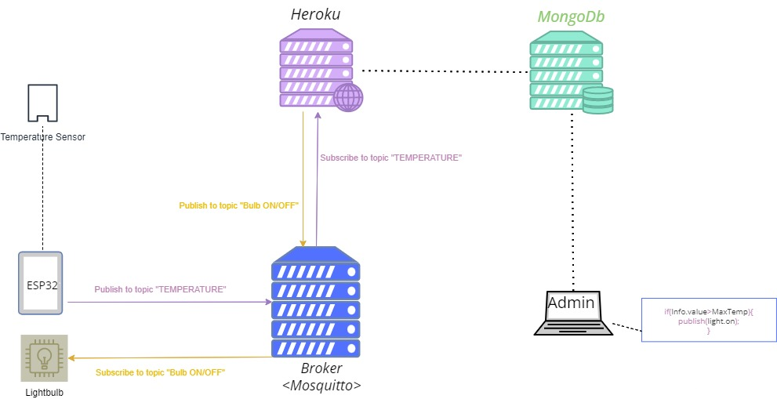
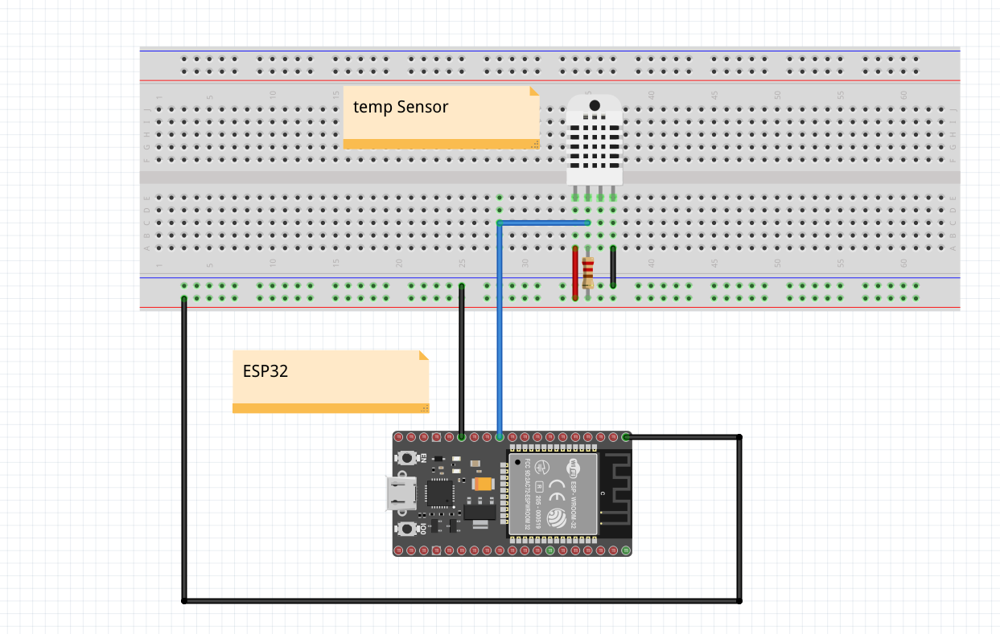
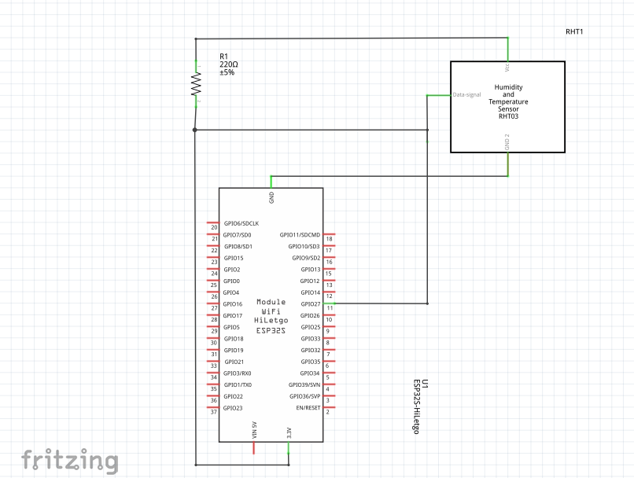

# <u>**Projet tuteuré :**</u>

- **Matériaux** : Esp32, DHT11 ou DHT22, BreadBoard,Jumper wires.
  
- **Technologies** : React (Front end), Node.js, MongoDB.
  
- **IDE** : Arduino, VS Code.
  
- **Prototypage** : Fritzing.
  

# **1-Business Diagram :**

# **2-BreadBoard :**

# **3-Schematic:**

# **3-Use case diagram:**

